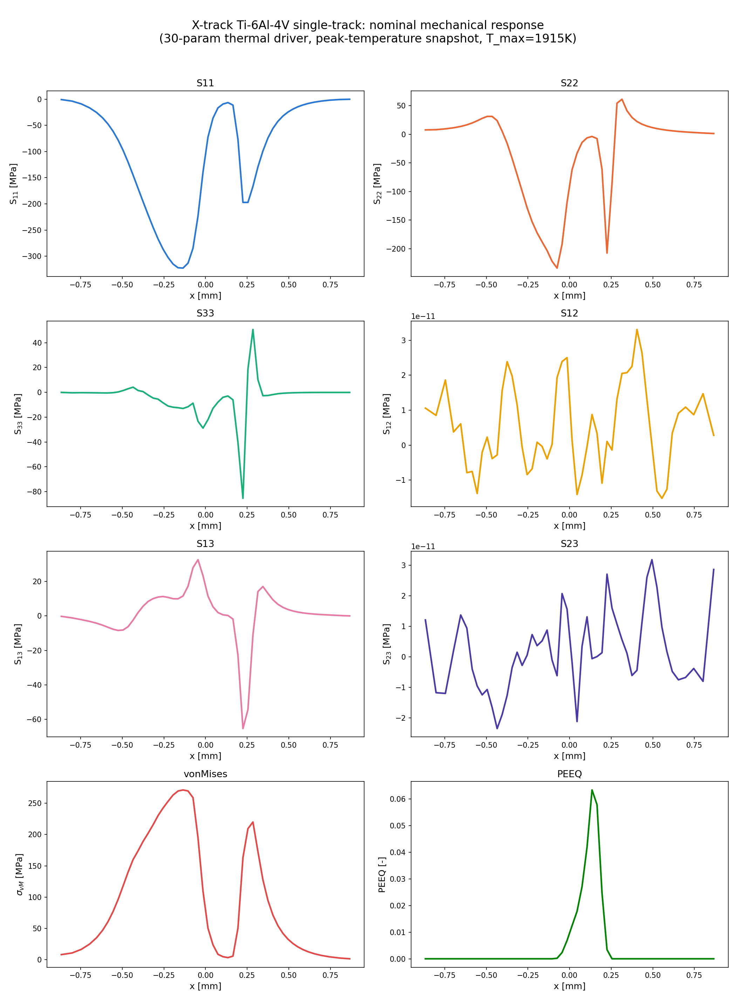
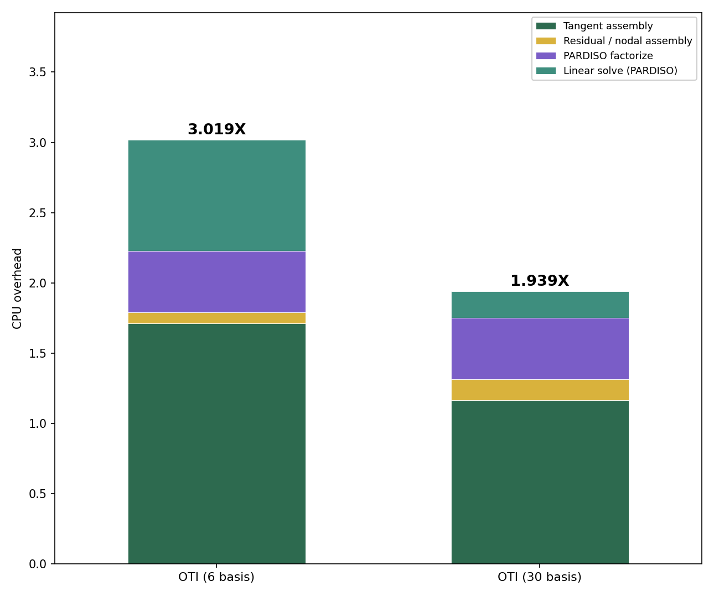
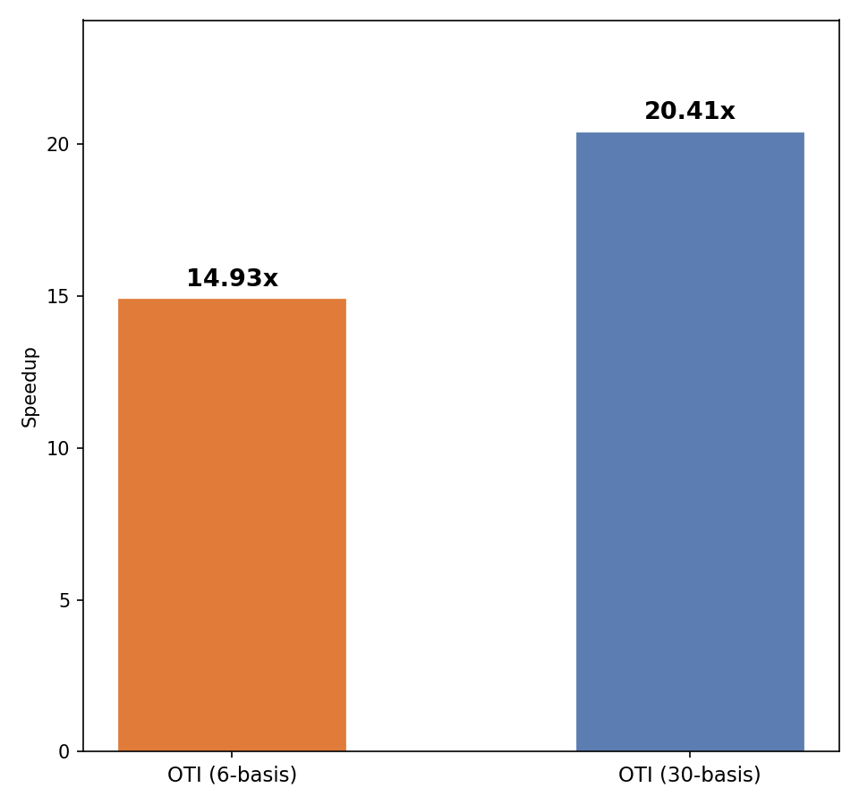

# MFEM-LPBF-AM

**High-order sensitivity analysis for laser powder-bed-fusion (LPBF) additive
manufacturing, built on [MFEM](https://mfem.org).**

This repository holds the finite-element solver, sensitivity-analysis library,
result data, figures, and technical reports for a coupled
**thermal + mechanical** model of a single-track LPBF scan in Ti-6Al-4V, with
**first- and second-order parametric sensitivities** computed in a single
forward pass by hypercomplex (multi-directional dual-number) automatic
differentiation.

> **Status:** the figures, result data, and technical reports are in the
> repository now. The MFEM solver and sensitivity drivers are being migrated
> in from the development tree and will land under `src/` — see
> [Roadmap](#roadmap).

---

## What this project computes

Given a transient LPBF thermal simulation (moving Goldak/point laser source,
temperature-dependent Ti-6Al-4V properties, phase change) and the mechanical
response it drives (Hill anisotropic thermo-plasticity, B-bar elements), the
code returns:

1. The **nominal** temperature and stress/strain fields.
2. The **first derivative** of every response with respect to up to **30**
   material, boundary, and laser-source parameters
   (`k, cp, ρ, Tsol, Tliq, Lfusion, h_c, T0, P, η, r_x, r_y, r_z, x0, y0,
   Vx, Vy, t_L, l_L, …`).
3. The **pure second derivatives** with respect to those same parameters.

All sensitivity directions are propagated **simultaneously in one nonlinear
solve** using a self-contained multi-directional dual number (`OTI30`), rather
than by re-running the simulation once per parameter. This is the same idea as
HYPAD-FEM (hypercomplex automatic differentiation FEM); see
[References](#references).

### Why not finite differences?

Central finite differencing the full 30-parameter target needs **60 additional
nonlinear solves** (2 per parameter). The one-pass AD approach delivers the
same 30 first derivatives at a fraction of that cost:

| Library | Wired dirs | AD total cost (× nominal) | Speed-up vs central FD (N = 30) |
|---|---|---|---|
| OTI, 6-basis (legacy production) | 19 | ≈ 4.0× | ≈ 15× |
| OTI, 30-basis (this work) | 16 | ≈ 2.9× | ≈ 20× |

*(Full 8447-step simulation, MKL PARDISO, extra cost = sensitivity pass only,
normalized to the driver's own nominal solve.)*

---

## Repository layout

```
MFEM-LPBF-AM/
├── figures/                 Publication-quality figures (PNG) + their plot scripts
│   ├── thermo/nominal/       Thermal nominal response (phase-change probe traces)
│   └── mechanical/
│       ├── first_order/      dσ/dE, dσ/dν vs finite-difference cross-checks
│       ├── second_order/     d²σ/dE², d²σ/dν² vs finite-difference cross-checks
│       └── computational_cost/  Cost-optimization + AD-vs-FD speed-up studies
├── reports/                 LaTeX + compiled PDF technical notes
│   └── computational_cost_seven_fixes.{tex,pdf}
├── papers/                  Reference literature
└── src/                     Solver + sensitivity drivers  (migration in progress)
```

---

## Key results

### Thermal / mechanical validation

- **Thermal (single-track Ti-6Al-4V):** peak-temperature error ≈ 1.7 % vs an
  independent Abaqus reference on the same mesh/material/BCs; first-order
  sensitivities (`k, cp, ρ, Lfusion`) verified to < 0.1 % against real Abaqus
  derivative runs.
- **Mechanical (Hill thermo-plasticity):** peak von Mises ≈ 277 MPa, peak PEEQ
  ≈ 0.063 at the peak-temperature snapshot. First-order OTI vs finite
  difference < 0.35 % NRMS; second-order (ν) < 0.5 % NRMS. The residual in the
  second derivative of `E` is localized to a ~0.3 mm band around the
  elastic–plastic front and is a genuine front-motion effect, not solver error
  (confirmed by step-size and solver-tolerance refinement).

<p align="center">
  
</p>

### Computational cost of the 30-parameter sensitivity library

Seven cumulative optimizations reduced the 30-basis library's full-simulation
**extra cost from 2.883× to 1.939×** the nominal solve — a 32.8 % reduction,
and the first result under the project's 2× target. Full write-up:
[`reports/computational_cost_seven_fixes.pdf`](reports/computational_cost_seven_fixes.pdf).

| State | Extra cost, `X = extra / nominal` |
|---|---|
| Original (31-basis, single-RHS PARDISO) | 2.883× |
| + compact basis renumbering + batched multi-RHS PARDISO solve | 2.357× |
| + boundary/domain assembly fixes (geometry cache, radiation skip, loop interchange) | — |
| + `ġ` hoisting + second-order-storage gating (**all 7 fixes**) | **1.939×** |

The two largest wins — a single batched multi-RHS PARDISO solve per step, and
hoisting a direction-independent gradient dot product out of the per-direction
loop — both targeted a *provable* algorithmic redundancy. Fixes motivated only
by instruction-count profiling consistently under-delivered; every fix was
verified twice, for bit-identical output **and** by direct wall-clock timing.

<p align="center">
  
  
</p>

---

## Reproducing the figures

Each figure has a sibling `plot_*.py` script next to it. The scripts embed the
measured numbers (with provenance — job IDs, step counts, node-variance
caveats — in their header comments) and only need `matplotlib`:

```bash
cd figures/mechanical/computational_cost
python plot_firstorder_final_comparison.py
python plot_speedup_ad_vs_fd_N30.py
```

Building the report:

```bash
cd reports && pdflatex computational_cost_seven_fixes.tex
```

---

## Benchmark setup

| | |
|---|---|
| Model problem | Ti-6Al-4V single-track laser scan (moving source, phase change) |
| Mesh (`fastverify`) | 17,160 hexahedral elements, 19,716 DOFs, linear H1 |
| Trajectory | 8447 accepted steps, 355 reassemblies (bit-identical across drivers) |
| Linear solver | MKL PARDISO (factorize once per step, batched multi-RHS) |
| Sensitivity type | `OTI30` — hand-written multi-directional dual number, first + pure second order |
| Radiation | neglected (`ε = 0`), matching the reference paper's assumption |

---

## Roadmap

- [x] Nominal thermal + mechanical response, validated vs Abaqus
- [x] First-order 30-parameter sensitivities (OTI vs FD / Abaqus)
- [x] Pure second-order sensitivities (E, ν)
- [x] First-order computational-cost optimization (2.883× → 1.939×)
- [ ] Migrate solver + drivers into `src/` with build instructions
- [ ] Second-order computational-cost study (same methodology, one order up)
- [ ] Multilayer element-activation extension
- [ ] Residual-stress prediction (AMB2018-01 IN625 bridge)

---

## References

- Rincón-Tabares *et al.*, first-order sensitivity analysis of additive
  manufacturing using HYPAD-FEM, *Progress in Additive Manufacturing* (2025).
  Reports a 1.78× extra-cost figure for an equivalent 30-parameter
  computation (normalized to Abaqus runtime — not directly comparable to the
  self-normalized `X` used here, but a useful magnitude check).
- Juan Sebastián — phase-change formulation note,
  [`papers/juan_sebastian_phase_change_paper.pdf`](papers/juan_sebastian_phase_change_paper.pdf)
- W. Lu *et al.*, temperature-dependent Ti-6Al-4V elastic-plastic properties
  (2018) — source of the mechanical property tables.
- [MFEM: Modular Finite Element Methods library](https://mfem.org)

---

## Author

Daniel F. Morales-Bernal — AMMS Lab, University of Texas at San Antonio.

## License

To be added.
